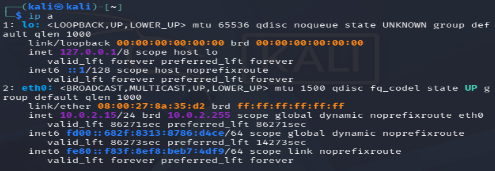
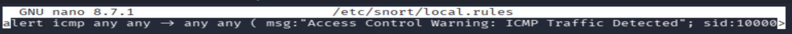
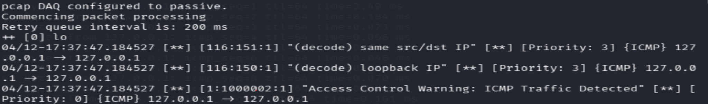

# CS 565 Term Project: Access Control Warnings

## What are Access Control Warnings?

Unauthorized access control warnings are security alerts triggered when a system detects abnormal or unwarranted attempts to access data or resources. These warnings typically come from intrusion detection systems (IDS), behavior-based analytics, and authentication monitoring. In layman's terms, it is when a person or persons attempt to access a system without permission, or when a user behaves outside their normal pattern. Attempts to gain access to these systems usually generate multiple failed login attempts.

## Example Vulnerabilities of Access Control

### Faulty Monitoring

Attacks against access control often go unnoticed. Zero-day exploits are attacks or vulnerabilities unknown to the vendor or developer, with no patch available to mitigate them. This relates to faulty monitoring because threat actors can use these exploits to bypass intrusion detection systems that cannot detect them, leading to unnoticed data theft. An example is a brute-force attack where up to fifty login attempts are made but no warning is triggered.

## Lab

This lab demonstrates how access control warnings can be generated and analyzed using an intrusion detection system in Kali Linux, with Snort configured to monitor network traffic.

### Step 1: Identify the network interface

Run `ip a` to analyze the system's network interfaces. This identifies the primary interface (`eth0`) and its IPv4 address, which is used for traffic monitoring.

```bash
ip a
```



Then open the Snort configuration:

```bash
sudo nano /etc/snort/snort.conf
```

### Step 2: Validate the configuration

Check that the configuration is valid:

```bash
sudo snort -c /etc/snort/snort.lua -T
```

### Step 3: Add a local rule

Open the local rules file:

```bash
sudo nano /etc/snort/rules/local.rules
```

Paste in the following rule:

```
alert icmp any any -> any any ( msg:"Access Control Warning: ICMP Traffic Detected"; sid:1000002; rev:1; )
```



### Step 4: Enable the rules in the Snort config

Open the Snort configuration:

```bash
sudo nano /etc/snort/snort.lua
```

Then add this block for the IDS:

```lua
ips =
{
    enable_builtin_rules = true,
    rules = [[
        include /etc/snort/rules/local.rules
    ]]
}
```

### Step 5: Revalidate the configuration

```bash
sudo snort -c /etc/snort/snort.lua -T
```

### Step 6: Run Snort

In the first terminal, start Snort:

```bash
sudo snort -c /etc/snort/snort.lua -i lo -A alert_fast -k none
```

### Step 7: Trigger the ICMP rule

In a second terminal, send pings to trigger the Access Control Warning:

```bash
ping -c 4 127.0.0.1
```

### Results

First terminal with Snort running, showing the "Access Control Warning" alerts:



Second terminal running the ping command:


## Existing Warning Systems

**Intrusion Detection Systems (IDS)**, for example Snort:

- Monitor network traffic in real time
- Detect suspicious patterns (e.g., repeated access attempts)
- Generate alerts based on predefined rules

## Improvements to Warning Systems

- Detect anomalies instead of relying only on rules
- Identify unusual login patterns or access behavior
- Reduce false positives
